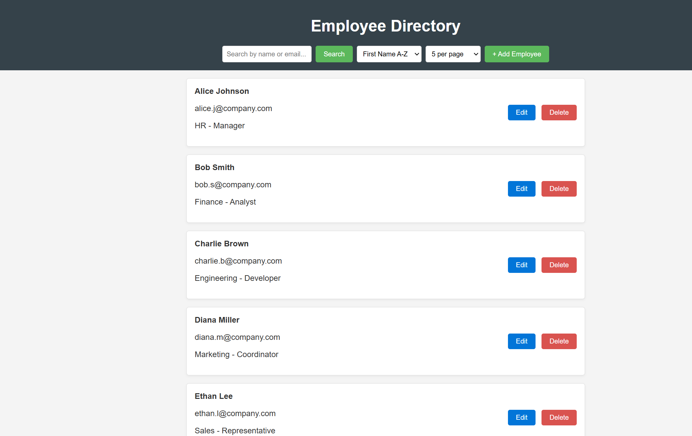

### 📁 `README.md`

# Employee Directory Management System

A web-based Employee Directory Management System that allows users to **view**, **add**, **edit**, **delete**, **search**, and **sort** employee records. This project is built using **HTML**, **CSS**, and **JavaScript**, and runs entirely in the browser with no backend dependency.

---

## 🚀 Features

- 📋 View employee list in a card-based layout.
- 🔍 Search employees by name or email.
- 🧭 Sort by first name, last name, department, or role (ascending/descending).
- ➕ Add new employee records via a modal form.
- ✏️ Edit existing employee details.
- ❌ Delete employee records with confirmation.
- 📄 Pagination and adjustable page size.

---

## 📂 Project Structure

```

employee-directory/
├── index.html # Main HTML structure
├── style.css # Styling and responsive layout
├── script.js # Core functionality and interactivity
└── README.md # Project documentation

```

---

## 🛠 How to Use

1. **Clone or Download** the repository:

```

git clone https://github.com/LawanGoud/Ajackus-Employee-Directory.git

```

2. **Open `index.html`** in any modern browser (Chrome, Firefox, Edge, etc.).

> 💡 All changes are stored in-memory; refreshing the page resets the data.

---

## ✅ Requirements

- A modern web browser (Chrome, Firefox, Safari, Edge).
- No external libraries or frameworks are required.

---

## 🎨 Customization

You can modify or expand the data inside the `directory` array in `script.js` to preload more employees. You can also:

- Add dropdown filters for departments/roles.
- Implement persistent storage using `localStorage` or connect to a backend.
- Add profile images or other fields (e.g., phone, address).

---

## 📸 Preview



---

## 📃 License

This project is open-source and free to use. Attribution is appreciated but not required.

---

## 👨‍💻 Author

Developed by **Lawan Kumar**
For internal employee directory management.
